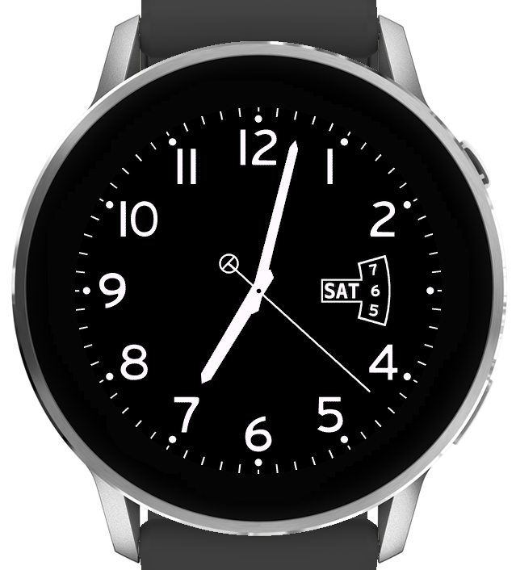
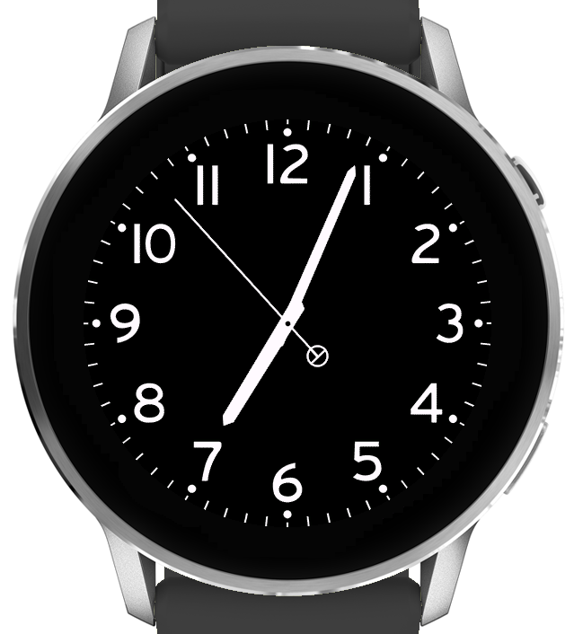

# Field Inverted — Garmin Venu 4 watch face

A color-inverted (white-on-black, OLED-friendly) classic field-watch dial for the
**Garmin Venu 4 (45 mm, 454×454)**, written in Monkey C. The numerals are an original,
hand-drawn set. Two variants are produced from one source:

| Variant | App name | 3-o'clock |
|---|---|---|
| `bin/FieldInverted-Widget.prg` | Field Inverted   | live day + date wheel (yesterday / today / tomorrow) |
| `bin/FieldInverted-Plain.prg`  | Field Inverted 3 | plain "3" numeral |

> **No logo is shipped.** The dial's logo slot (below the 12) is **empty** in this repo.
> You add your own logo at build time — see below.

## Screenshots

| With date wheel | Plain "3" |
|:---:|:---:|
|  |  |

*(Shown with an empty logo slot. Garmin Venu 4 45 mm.)*

## Build your own

Works on **any Linux** distro and on **Windows via WSL** (run it inside the WSL/Linux shell).

> 🪟 **On Windows and never used a terminal?** Follow the click-by-click guide:
> **[BUILD-ON-WINDOWS.md](BUILD-ON-WINDOWS.md)** — it covers everything from zero.

**Requirements** (the script checks and tells you what's missing):
- **Connect IQ SDK** with the `venu445mm` device installed — get it from
  <https://developer.garmin.com/connect-iq/sdk/> and add the device via the SDK Manager.
  (Custom install path? `export CIQ_SDK_HOME=$HOME/.Garmin/ConnectIQ/Sdks/connectiq-sdk-lin-x.y.z`.)
- **python3 + Pillow** — `python3 -m pip install pillow`
- **openssl** and **java** (Java is needed by the Connect IQ compiler)

**Steps:**

```bash
# 1. (optional) drop your logo in — PNG, white-on-transparent looks best;
#    plain dark-on-white art also works. Omit it for a blank slot.
cp my-logo.png assets/logo.png

# 2. build both faces (auto-generates a signing key on first run)
./build-your-own.sh

# 3. sideload: connect the watch (MTP) and copy a .prg from bin/ into GARMIN/Apps/,
#    then restart the watch face.
```

Your logo is fit-centered into the slot automatically (any aspect ratio).

### What you get

Two finished watch-face files land in the **`bin/`** folder:

| File | What it shows |
|---|---|
| `bin/FieldInverted-Widget.prg` | dial with the day + date window |
| `bin/FieldInverted-Plain.prg`  | dial with a plain "3" |

Install either one (or both — they have different app IDs and appear as two separate faces).

### Installing on the watch

1. Connect the Venu 4 by USB and unlock it; it mounts as a drive/MTP device named **Venu 4**
   (it may contain a `Primary` or `Internal Storage` folder).
2. Open **`GARMIN/Apps`** on the watch.
3. Copy the `.prg` **directly into `Apps`** and eject.
   > **The file goes loose inside `Apps` — it does NOT get its own subfolder, and don't rename it.**
   > Correct: `GARMIN/Apps/FieldInverted-Widget.prg` — Wrong: `GARMIN/Apps/FieldInverted/…`
4. On the watch, open the watch-face list and pick **Field Inverted**.

## How the logo works

Connect IQ can't read user-supplied files or upload images at runtime, so the logo is
**baked in at build time**: `tools/place_logo.py` (pure Pillow) composites `assets/logo.png`
onto the committed, **logo-free** dial bases in `prebuilt/`. Nothing copyrighted ships in
the repo; each build is personalized locally.

## Repo layout

- `build-your-own.sh` — portable end-user build (Pillow + OpenSSL + Java + SDK only).
- `tools/place_logo.py` — composites your logo onto the dial bases.
- `prebuilt/dial_*_base.png` — logo-free dial bases (committed).
- `resources/drawables/` — date digits, day labels, drawables manifest.
- `source/`, `source-widget/`, `source-plain/` — Monkey C (the `WITH_WIDGET` flag selects the variant).
- `manifest_*.xml`, `monkey_*.jungle` — per-variant app IDs and build configs.

### Art assets

The dial bases, date digits, and day labels are **pre-generated and committed**, so building
needs no image/font toolchain — only the requirements listed above. The only thing you supply
is your own `assets/logo.png`.

## Notes

Personal project, not affiliated with or endorsed by any watch manufacturer. Trademarks
belong to their respective owners. Distributed by USB sideload.

## License

Copyright © 2026 d-packs. Licensed under the **GNU General Public License v3.0** —
see [LICENSE](LICENSE).
